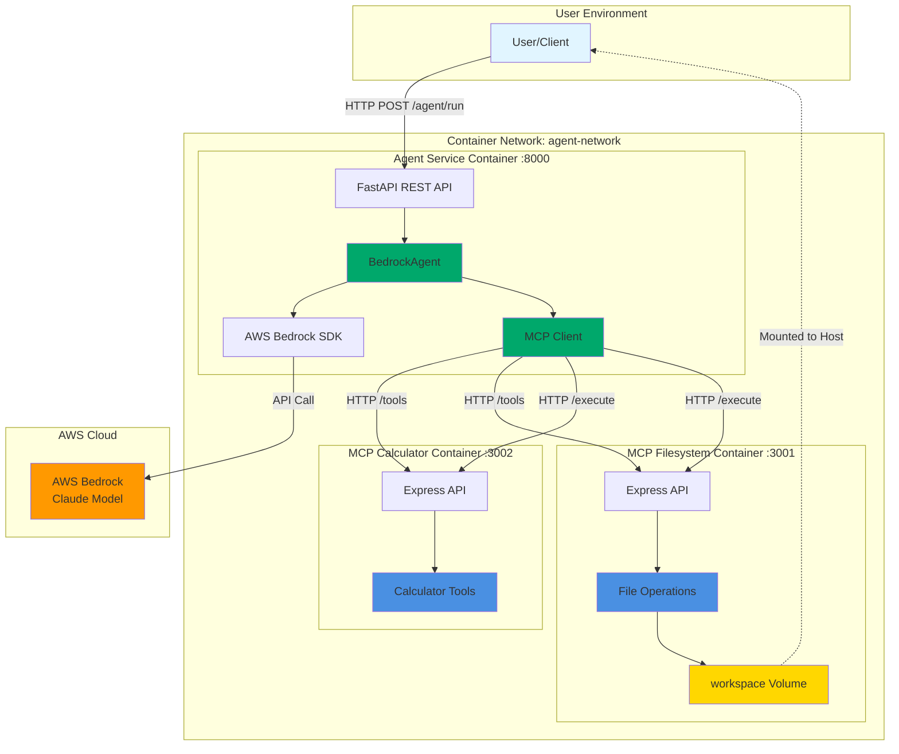
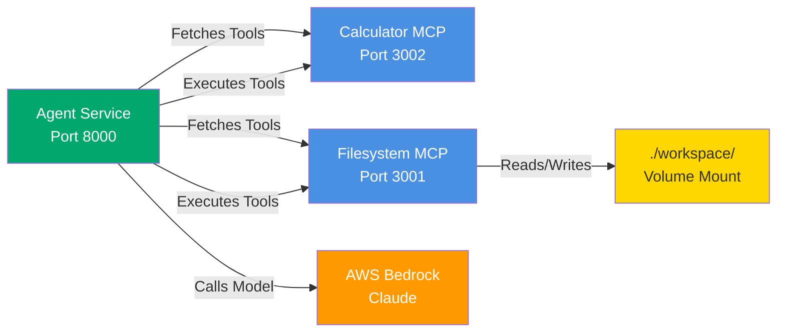
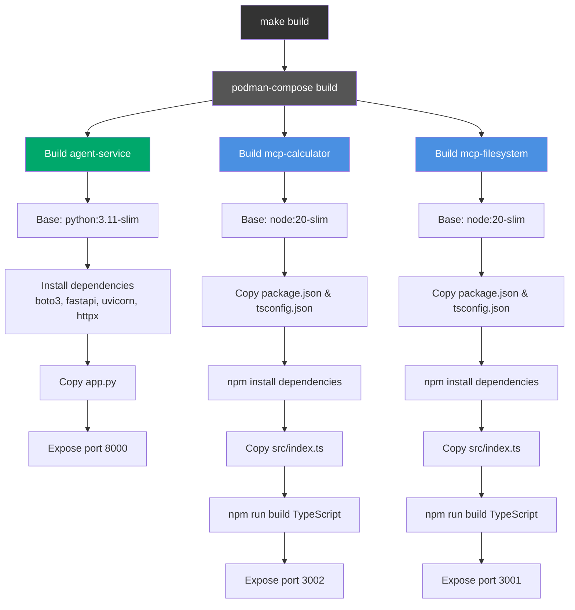
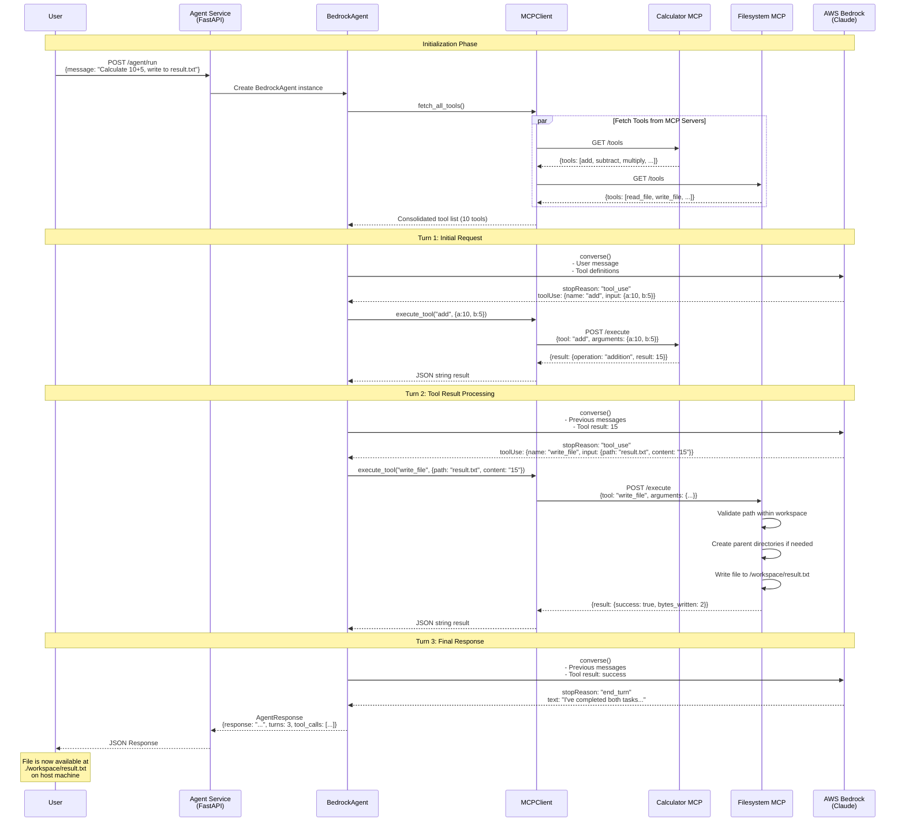

# Bedrock Agent with MCP Servers - Deep Dive

## Table of Contents
1. [System Overview](#system-overview)
2. [Architecture](#architecture)
3. [Build Process](#build-process)
4. [Component Details](#component-details)
5. [Request Flow Analysis](#request-flow-analysis)
6. [Example Walkthrough](#example-walkthrough)
7. [Extending the System](#extending-the-system)

---

## System Overview

This is a containerized AI agent system that uses **AWS Bedrock** (Claude model) with **Model Context Protocol (MCP)** servers to provide tool-calling capabilities. The system consists of three main services:

1. **Agent Service** (Python/FastAPI) - Orchestrates the AI conversation with Bedrock
2. **Calculator MCP Server** (Node.js/TypeScript) - Provides mathematical operations
3. **Filesystem MCP Server** (Node.js/TypeScript) - Provides file system operations

The services communicate over HTTP within a container network, enabling the AI model to execute tools through a well-defined protocol.

---

## Architecture

### High-Level System Architecture



### Component Interactions



---

## Build Process

### What `make build` Does

When you run `make build`, the following happens:

1. **Podman Compose** reads `podman-compose.yml`
2. Three Docker images are built in parallel:



---

## Component Details

### 1. Agent Service (Python)

**File**: `agent-service/app.py`

**Key Classes**:

- **`MCPClient`**: Manages communication with MCP servers
  - `fetch_all_tools()`: Retrieves tool definitions from all MCP servers
  - `execute_tool()`: Executes a specific tool on the appropriate MCP server

- **`BedrockAgent`**: Main agent loop that orchestrates AI interactions
  - `run()`: Executes the agent loop with conversation management

**FastAPI Endpoints**:
- `GET /` - Service info
- `GET /health` - Health check
- `GET /tools` - List all available tools from MCP servers
- `POST /agent/run` - Run the agent with a user message

**Technology Stack**:
- FastAPI for REST API
- boto3 for AWS Bedrock integration
- httpx for async HTTP calls to MCP servers
- Pydantic for data validation

### 2. Calculator MCP Server (TypeScript)

**File**: `mcp-servers/calculator/src/index.ts`

**Available Tools**:
- `add(a, b)` - Addition
- `subtract(a, b)` - Subtraction
- `multiply(a, b)` - Multiplication
- `divide(a, b)` - Division (with zero-check)
- `power(base, exponent)` - Exponentiation
- `sqrt(number)` - Square root (with negative-check)

**Endpoints**:
- `GET /` - Health check
- `GET /tools` - Returns tool definitions in MCP schema format
- `POST /execute` - Executes a tool with provided arguments

**Tool Schema Format**:
```json
{
  "name": "add",
  "description": "Add two numbers together",
  "inputSchema": {
    "type": "object",
    "properties": {
      "a": {"type": "number", "description": "First number"},
      "b": {"type": "number", "description": "Second number"}
    },
    "required": ["a", "b"]
  }
}
```

### 3. Filesystem MCP Server (TypeScript)

**File**: `mcp-servers/filesystem/src/index.ts`

**Available Tools**:
- `read_file(path)` - Read file contents
- `write_file(path, content)` - Write content to file
- `list_directory(path)` - List directory contents
- `create_directory(path)` - Create a directory

**Security Features**:
- Path validation to ensure operations stay within `/workspace`
- Automatic directory creation for write operations
- Detailed error handling

**Volume Mount**:
- Container path: `/workspace`
- Host path: `./workspace/`
- This allows files written by the agent to persist on the host

---

## Request Flow Analysis

### Complete Sequence Diagram



---

## Example Walkthrough

Let's trace the exact execution of:

```bash
curl -X POST http://localhost:8000/agent/run \
  -H "Content-Type: application/json" \
  -d '{
    "message": "Calculate 10 + 5, then write the result to a file called result.txt"
  }'
```

### Step-by-Step Execution

#### **Step 1: Request Reception**
- FastAPI receives POST at `/agent/run` endpoint (line 274-282 in `app.py`)
- Creates `BedrockAgent` instance with configured model ID
- Calls `agent.run(message, max_turns=10)`

#### **Step 2: Tool Discovery**
```python
# agent-service/app.py, line 137
tools = await mcp_client.fetch_all_tools()
```

MCPClient makes parallel HTTP calls:
- `GET http://mcp-calculator:3002/tools`
- `GET http://mcp-filesystem:3001/tools`

Receives 10 tools total:
- Calculator: `add`, `subtract`, `multiply`, `divide`, `power`, `sqrt`
- Filesystem: `read_file`, `write_file`, `list_directory`, `create_directory`

#### **Step 3: First Bedrock Call**
```python
# agent-service/app.py, line 147-154
response = bedrock.converse(
    modelId=self.model_id,
    messages=[{
        "role": "user",
        "content": [{"text": "Calculate 10 + 5, then write the result..."}]
    }],
    toolConfig={"tools": tools, "toolChoice": {"auto": {}}}
)
```

**Bedrock Response**:
```json
{
  "stopReason": "tool_use",
  "output": {
    "message": {
      "role": "assistant",
      "content": [{
        "toolUse": {
          "toolUseId": "tooluse_xyz123",
          "name": "add",
          "input": {"a": 10, "b": 5}
        }
      }]
    }
  }
}
```

#### **Step 4: First Tool Execution**
```python
# agent-service/app.py, line 194
result = await mcp_client.execute_tool("add", {"a": 10, "b": 5})
```

MCPClient sends:
```http
POST http://mcp-calculator:3002/execute
Content-Type: application/json

{
  "tool": "add",
  "arguments": {"a": 10, "b": 5}
}
```

Calculator executes (line 139-144 in `calculator/src/index.ts`):
```typescript
result = {
  operation: 'addition',
  inputs: [10, 5],
  result: 15
}
```

#### **Step 5: Second Bedrock Call (with tool result)**
```python
# agent-service/app.py, line 204-207
messages.append({
    "role": "user",
    "content": [{
        "toolResult": {
            "toolUseId": "tooluse_xyz123",
            "content": [{"text": '{"operation":"addition","inputs":[10,5],"result":15}'}]
        }
    }]
})
```

**Bedrock Response**:
```json
{
  "stopReason": "tool_use",
  "output": {
    "message": {
      "role": "assistant",
      "content": [{
        "toolUse": {
          "toolUseId": "tooluse_abc456",
          "name": "write_file",
          "input": {
            "path": "result.txt",
            "content": "15"
          }
        }
      }]
    }
  }
}
```

#### **Step 6: Second Tool Execution**
```python
result = await mcp_client.execute_tool("write_file", {
    "path": "result.txt",
    "content": "15"
})
```

MCPClient sends:
```http
POST http://mcp-filesystem:3001/execute
Content-Type: application/json

{
  "tool": "write_file",
  "arguments": {
    "path": "result.txt",
    "content": "15"
  }
}
```

Filesystem server executes (line 120-130 in `filesystem/src/index.ts`):
```typescript
const filePath = resolvePath("result.txt");  // /workspace/result.txt
await fs.mkdir(path.dirname(filePath), { recursive: true });
await fs.writeFile(filePath, "15", 'utf-8');
result = {
  success: true,
  path: "result.txt",
  bytes_written: 2
}
```

The file is written to `/workspace/result.txt` inside the container, which is mounted to `./workspace/result.txt` on the host.

#### **Step 7: Third Bedrock Call (with second tool result)**

Bedrock receives the tool result and generates final response:

**Bedrock Response**:
```json
{
  "stopReason": "end_turn",
  "output": {
    "message": {
      "role": "assistant",
      "content": [{
        "text": "I've completed both tasks:\n1. Calculated 10 + 5 = 15\n2. Wrote the result (15) to result.txt\n\nThe file has been created and contains the value 15."
      }]
    }
  }
}
```

#### **Step 8: Return Response**
```python
# agent-service/app.py, line 169-173
return AgentResponse(
    response="I've completed both tasks...",
    turns=3,
    tool_calls=[
        {"tool": "add", "input": {"a": 10, "b": 5}, "tool_use_id": "tooluse_xyz123"},
        {"tool": "write_file", "input": {...}, "tool_use_id": "tooluse_abc456"}
    ]
)
```

### Key Observations

1. **Agentic Loop**: The agent automatically determines it needs two tools based on the user's request
2. **Turn Count**: 3 turns total (initial → after add → after write_file)
3. **Tool Chaining**: The result from `add` (15) is used as input to `write_file`
4. **Conversation State**: The agent maintains the full message history across turns
5. **File Persistence**: Files written in the container appear on the host due to volume mount

---

## Extending the System

### Adding a New MCP Server

Here's a complete guide to adding a new MCP server:

#### 1. Create Server Structure

```bash
mkdir -p mcp-servers/my-new-server/src
cd mcp-servers/my-new-server
```

#### 2. Create `package.json`

```json
{
  "name": "mcp-my-new-server",
  "version": "1.0.0",
  "scripts": {
    "build": "tsc",
    "start": "node dist/index.js",
    "dev": "ts-node src/index.ts"
  },
  "dependencies": {
    "express": "^4.18.2",
    "cors": "^2.8.5"
  },
  "devDependencies": {
    "@types/express": "^4.17.17",
    "@types/cors": "^2.8.13",
    "@types/node": "^20.5.0",
    "typescript": "^5.1.6",
    "ts-node": "^10.9.1"
  }
}
```

#### 3. Create `tsconfig.json`

```json
{
  "compilerOptions": {
    "target": "ES2020",
    "module": "commonjs",
    "outDir": "./dist",
    "rootDir": "./src",
    "strict": true,
    "esModuleInterop": true,
    "skipLibCheck": true,
    "forceConsistentCasingInFileNames": true
  },
  "include": ["src/**/*"],
  "exclude": ["node_modules"]
}
```

#### 4. Create `src/index.ts`

```typescript
import express, { Request, Response } from 'express';
import cors from 'cors';

const app = express();
const PORT = process.env.PORT || 3003;

app.use(cors());
app.use(express.json());

// Define your tools
const TOOLS = [
  {
    name: 'my_tool',
    description: 'Description of what this tool does',
    inputSchema: {
      type: 'object',
      properties: {
        param1: {
          type: 'string',
          description: 'Description of parameter'
        }
      },
      required: ['param1']
    }
  }
];

// Health check
app.get('/', (req: Request, res: Response) => {
  res.json({
    service: 'MCP My New Server',
    status: 'running'
  });
});

// List tools
app.get('/tools', (req: Request, res: Response) => {
  res.json({ tools: TOOLS });
});

// Execute tool
app.post('/execute', async (req: Request, res: Response) => {
  const { tool, arguments: args } = req.body;

  try {
    let result: any;

    switch (tool) {
      case 'my_tool':
        // Your tool logic here
        result = {
          success: true,
          data: args.param1
        };
        break;

      default:
        return res.status(400).json({
          error: `Unknown tool: ${tool}`
        });
    }

    res.json({ result });
  } catch (error: any) {
    console.error(`Error executing ${tool}:`, error);
    res.status(500).json({
      error: error.message || 'Tool execution failed'
    });
  }
});

app.listen(PORT, () => {
  console.log(`MCP My New Server running on port ${PORT}`);
});
```

#### 5. Create `Dockerfile`

```dockerfile
FROM node:20-slim

WORKDIR /app

COPY package*.json ./
COPY tsconfig.json ./

RUN npm install

COPY src ./src

RUN npm run build

EXPOSE 3003

CMD ["npm", "start"]
```

#### 6. Update `podman-compose.yml`

Add your new service:

```yaml
services:
  # ... existing services ...

  mcp-my-new-server:
    build:
      context: ./mcp-servers/my-new-server
      dockerfile: Dockerfile
    container_name: mcp-my-new-server
    ports:
      - "3003:3003"
    environment:
      - PORT=3003
    networks:
      - agent-network
```

#### 7. Update Agent Service

In `agent-service/app.py`, add your server to the registry:

```python
MCP_MY_NEW_SERVER_URL = os.getenv("MCP_MY_NEW_SERVER_URL", "http://mcp-my-new-server:3003")

MCP_SERVERS = {
    "filesystem": MCP_FILESYSTEM_URL,
    "calculator": MCP_CALCULATOR_URL,
    "my-new-server": MCP_MY_NEW_SERVER_URL  # Add this line
}
```

Update the agent service in `podman-compose.yml`:

```yaml
agent-service:
  # ... existing config ...
  environment:
    # ... existing env vars ...
    - MCP_MY_NEW_SERVER_URL=http://mcp-my-new-server:3003
  depends_on:
    - mcp-filesystem
    - mcp-calculator
    - mcp-my-new-server  # Add this line
```

#### 8. Build and Test

```bash
make build
make up
curl http://localhost:3003/tools
```

### Adding a New Tool to Existing Server

To add a new tool to an existing server (e.g., calculator):

1. **Add tool definition** to the `TOOLS` array:

```typescript
{
  name: 'factorial',
  description: 'Calculate factorial of a number',
  inputSchema: {
    type: 'object',
    properties: {
      n: {
        type: 'number',
        description: 'Number to calculate factorial of'
      }
    },
    required: ['n']
  }
}
```

2. **Add execution logic** in the `POST /execute` handler:

```typescript
case 'factorial':
  if (args.n < 0) {
    return res.status(400).json({
      error: 'Factorial not defined for negative numbers'
    });
  }
  let fact = 1;
  for (let i = 2; i <= args.n; i++) {
    fact *= i;
  }
  result = {
    operation: 'factorial',
    input: args.n,
    result: fact
  };
  break;
```

3. **Rebuild the container**:

```bash
make build
make down
make up
```

The agent will automatically discover the new tool on the next request!

---

## Advanced Extension Patterns

### Adding Authentication to MCP Servers

```typescript
// Middleware for API key authentication
const authenticateApiKey = (req: Request, res: Response, next: Function) => {
  const apiKey = req.headers['x-api-key'];
  const validKey = process.env.API_KEY;

  if (!validKey || apiKey !== validKey) {
    return res.status(401).json({ error: 'Unauthorized' });
  }

  next();
};

app.post('/execute', authenticateApiKey, async (req: Request, res: Response) => {
  // Tool execution logic
});
```

### Adding Logging and Monitoring

```typescript
import winston from 'winston';

const logger = winston.createLogger({
  level: 'info',
  format: winston.format.json(),
  transports: [
    new winston.transports.File({ filename: 'error.log', level: 'error' }),
    new winston.transports.File({ filename: 'combined.log' })
  ]
});

app.post('/execute', async (req: Request, res: Response) => {
  const { tool, arguments: args } = req.body;
  logger.info('Tool execution started', { tool, args });

  try {
    // ... execution logic ...
    logger.info('Tool execution completed', { tool, result });
  } catch (error) {
    logger.error('Tool execution failed', { tool, error });
  }
});
```

### Adding Rate Limiting

```typescript
import rateLimit from 'express-rate-limit';

const limiter = rateLimit({
  windowMs: 15 * 60 * 1000, // 15 minutes
  max: 100, // Limit each IP to 100 requests per windowMs
  message: 'Too many requests from this IP'
});

app.use('/execute', limiter);
```

### Creating Tool Groups/Namespaces

```typescript
const TOOLS = [
  {
    name: 'math:advanced:integrate',
    description: 'Numerical integration',
    // ...
  },
  {
    name: 'math:basic:add',
    description: 'Addition',
    // ...
  }
];

// In execute handler, parse the namespace
const [namespace, category, operation] = tool.split(':');
```

---

## Troubleshooting

### Common Issues

1. **Tools not appearing**: Check MCP server logs with `make logs`
2. **File not written**: Verify volume mount in `podman-compose.yml` line 33
3. **Bedrock errors**: Check AWS credentials and model ID
4. **Connection refused**: Ensure all containers are on `agent-network`

### Debugging Tips

```bash
# Check if all services are running
podman ps

# View logs for specific service
podman logs agent-service
podman logs mcp-filesystem

# Test MCP servers directly
curl http://localhost:3001/tools
curl http://localhost:3002/tools

# Test tool execution
curl -X POST http://localhost:3001/execute \
  -H "Content-Type: application/json" \
  -d '{"tool": "list_directory", "arguments": {"path": "."}}'
```

---

## Summary

This system demonstrates a powerful pattern for building AI agents:

1. **Separation of Concerns**: Agent logic, tool implementation, and model inference are separated
2. **Modularity**: MCP servers can be added/removed without changing the agent
3. **Standardization**: MCP protocol provides a consistent interface
4. **Scalability**: Each component can be scaled independently
5. **Extensibility**: New tools and servers are easy to add

The architecture allows you to:
- Add new capabilities without touching the agent code
- Deploy tools in different languages (Python, TypeScript, etc.)
- Control tool access and permissions at the MCP server level
- Monitor and log tool usage independently
- Scale specific tools based on demand

This is a production-ready pattern for building sophisticated AI agent systems!
